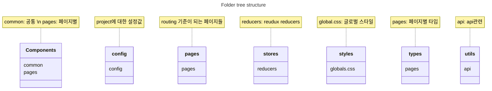

This is a [Next.js](https://nextjs.org/) project bootstrapped with [`create-next-app`](https://github.com/vercel/next.js/tree/canary/packages/create-next-app).

## Getting Started

First, run the development server:

```bash
npm run dev
# or
yarn dev
```

Open [http://localhost:3000](http://localhost:3000) with your browser to see the result.

Second, run the storybook server:

```bash
npm run storybook
# or
yarn storybook
```

Open [http://localhost:6006](http://localhost:6006) with your browser to see the result.

# Boilerplate project 소개

## 목적

Nextjs 기반 프로젝트를 빠르게 구성하기

## 구성

- Nextjs 기반 프로젝트로 아래와 같은 구성을 가지고 있다.

  - Style 관련 : twin.macro (styled-components + tailwindcss)
  - 비동기 관련 : axios, react-query
  - global state 관련 : redux, redux-toolkit
  - dev environment 관련 : prettier, eslint, typescript, storybook, react-query-devtools

- 폴더 구성



## Git commit message type

- feat: 새로운 기능 추가
- fix: "잘못된" 코드 수정
- update: "정상적인" 기존 기능 개선 및 추가
- dev: 개발 환경 관련

## 향후 계획

컴포넌트 추가

- [ ] 탭
- [ ] 테이블
- [x] 아이콘
- [x] 버튼
- [x] 드롭다운
- [ ] 셀렉터
- [ ] 텍스트 인풋
